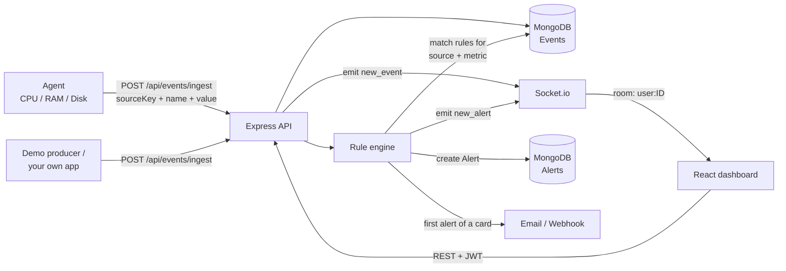

# Pulse — Real-Time Monitoring & Alerting Platform


Pulse is a **generic, self-serve monitoring platform**. Point any machine or application at a unique ingest URL, watch its data stream into a live dashboard, and get alerted the moment something crosses a line you defined — by email, in the app, or through a webhook.

| | Link |
|---|---|
| 🌐 Live app | https://pulse-monitoring.netlify.app/ |
| ⚙️ Backend API | https://pulse-ualv.onrender.com (health: `/api/health`) |
| 📦 Source | https://github.com/Divyanshu-bisht/pulse |

> **Heads-up:** the backend runs on a free Render instance, which sleeps when idle. The first request after a quiet period can take ~30–60 seconds to wake it up.

---

## Table of contents

- [Why Pulse exists](#why-pulse-exists)
- [Features](#features)
- [How it works](#how-it-works)
- [Tech stack](#tech-stack)
- [Project structure](#project-structure)
- [Quick start](#quick-start)
- [Environment variables](#environment-variables)
- [Connecting a data source](#connecting-a-data-source)
- [Alert rules and the alert lifecycle](#alert-rules-and-the-alert-lifecycle)
- [API reference](#api-reference)
- [Data model](#data-model)
- [Security](#security)
- [Deployment](#deployment)
- [Testing and CI](#testing-and-ci)
- [Known limitations and roadmap](#known-limitations-and-roadmap)

---

## Why Pulse exists

Teams usually watch their systems through a patchwork of tools: one dashboard for servers, another for the payment provider, logs somewhere else, and nothing that tells them *"something is wrong"* until a customer complains.

Pulse solves that with one idea: **everything is just an event with a name and a value.** A CPU reading, a failed payment, a low-stock warning — they all flow through the same pipeline:

1. **Ingest** it through a single authenticated endpoint.
2. **Store** it and **stream** it live to your dashboard.
3. **Evaluate** it against your rules and **alert** you instantly.

Because the pipeline is domain-agnostic, the same platform monitors a laptop's CPU and an e-commerce store's order flow — the repo ships with a demo of both.

## Features

**Monitoring**
- Live dashboard with source status (online/offline based on a 30-second heartbeat), counts, and a real-time event feed
- Per-source line charts (Recharts) with 1h / 24h / 7d ranges that also update live as new events arrive
- Raw event log for the most recent events
- Two source types: **Agent** (system metrics) and **Webhook** (any custom event over HTTP)

**Alerting**
- Three rule conditions: value **greater than**, value **less than**, and **count greater than** within a rolling time window
- Metric dropdown populated from what the source has *actually sent*, so rules can't reference a name that doesn't exist
- Grouped alert cards with occurrence counters, **Acknowledge** (pauses the rule) and **Reset** (clears history and re-arms)
- One email per alert card, not one per event — no inbox flooding
- Optional per-rule **webhook** with 3 attempts and exponential backoff (1s, 2s)
- Instant in-app delivery over WebSockets

**Accounts & security**
- JWT authentication (7-day expiry), bcrypt-hashed passwords
- Forgot / reset password flow with a one-hour single-use token
- Per-user data isolation on every query
- Rate limiting, ingest payload validation, CORS locked to the frontend origin
- Source key **rotation** if a key ever leaks

**Operations**
- `GET /api/health` reports API and database status for uptime checks
- Nightly retention job deletes events older than `RETENTION_DAYS` (default 30)
- Request logging with `morgan`
- Email via **Resend HTTP API** (works on hosts that block SMTP) with **SMTP** fallback and a console-log fallback if neither is configured
- GitHub Actions CI running the backend test suite

## How it works



1. A **source** (created on the dashboard) gets a unique `sourceKey`.
2. An **agent or any HTTP client** posts events using that key. No login is needed to send data — the key identifies the owner.
3. The backend validates the payload, updates the source's `lastSeen`, stores the event, and pushes it to the owner's private Socket.io room (`user:<id>`).
4. The **rule engine** immediately checks the event against every active rule for that source and metric.
5. A triggered rule creates an alert, pushes it live, and — only for the first alert of a card — sends the email and webhook.

## Tech stack

| Layer | Technology |
|---|---|
| Frontend | React 18, React Router 6, Recharts, Axios, socket.io-client, plain CSS |
| Backend | Node.js (18+), Express 4, Socket.io 4, Mongoose 8 |
| Database | MongoDB (Atlas in production) |
| Auth | JSON Web Tokens, bcryptjs |
| Email | Resend HTTP API, Nodemailer (SMTP fallback) |
| Scheduling | node-cron |
| Hardening | express-rate-limit, CORS allow-list, morgan |
| Agent | Node.js, `systeminformation`, Axios |
| Testing / CI | Jest, GitHub Actions |
| Hosting | Netlify (frontend), Render (backend) |

## Project structure

```
pulse/
├── backend/
│   ├── server.js              # Express + Socket.io bootstrap, rate limits, health check
│   ├── middleware/auth.js     # JWT verification
│   ├── models/                # User, Source, Event, Rule, Alert
│   ├── routes/                # auth, sources, events, rules, alerts, settings
│   ├── services/
│   │   ├── ruleEngine.js      # Evaluates events, creates alerts, sends notifications
│   │   ├── mailer.js          # Resend API → SMTP → console fallback
│   │   └── retention.js       # Nightly cleanup job
│   └── tests/                 # Jest tests
├── frontend/
│   └── src/
│       ├── pages/             # Landing, Login, Signup, Dashboard, SourceDetail,
│       │                      # AddSource, Rules, Alerts, Settings, password reset
│       ├── components/        # Navbar, Modal
│       ├── api.js             # Axios instance with JWT + 401 handling
│       └── socket.js          # Authenticated Socket.io client
├── agent/                     # Reports CPU, RAM, disk activity, uptime
├── demo-producer/             # Simulates e-commerce events
└── .github/workflows/ci.yml   # Runs backend tests on push / PR
```

## Quick start

### Prerequisites
- Node.js **18 or newer** (the backend uses the built-in `fetch`)
- A MongoDB database — local, or a free [MongoDB Atlas](https://www.mongodb.com/atlas) cluster

### 1. Clone

```bash
git clone https://github.com/Divyanshu-bisht/pulse.git
cd pulse
```

### 2. Backend

```bash
cd backend
npm install
cp .env.example .env      # then edit .env (see the table below)
npm run dev               # http://localhost:5000
```

### 3. Frontend

```bash
cd frontend
npm install
cp .env.example .env
npm start                 # http://localhost:3000
```

### 4. Use it

1. Open http://localhost:3000 and **sign up**.
2. Go to **Dashboard → Add source**, name it, and copy the generated **source key**.
3. Start the [agent](#option-a--the-system-agent) or [demo producer](#option-c--the-demo-producer) with that key.
4. The source's status dot turns green on the first event; open it to see live charts.
5. Create a rule under **Rules**, then watch **Alerts**.

## Environment variables

### `backend/.env`

| Variable | Required | Description |
|---|---|---|
| `PORT` | no | Port to listen on (default `5000`) |
| `MONGO_URI` | **yes** | MongoDB connection string |
| `JWT_SECRET` | **yes** | Long random string used to sign tokens. Generate one: `node -e "console.log(require('crypto').randomBytes(48).toString('hex'))"` |
| `CLIENT_URL` | **yes** | Exact frontend origin, **no trailing slash** (e.g. `http://localhost:3000` or `https://pulse-monitoring.netlify.app`). Used for CORS, Socket.io, and password-reset links |
| `RESEND_API_KEY` | no | Enables email via Resend's HTTP API (recommended in production) |
| `ALERT_FROM_EMAIL` | no | Sender address (default `onboarding@resend.dev`) |
| `SMTP_HOST` `SMTP_PORT` `SMTP_USER` `SMTP_PASS` | no | SMTP fallback, used only when `RESEND_API_KEY` is empty |
| `RETENTION_DAYS` | no | Days of events to keep (default `30`) |

> **Email notes.** With no email provider configured, Pulse still works — emails are logged to the server console instead. Resend's default `onboarding@resend.dev` sender only delivers to the address that owns your Resend account; verify a domain to email anyone else. Many hosts (including Render's free tier) block SMTP ports, which is why the HTTP API is preferred.

### `frontend/.env`

| Variable | Example |
|---|---|
| `REACT_APP_API_URL` | `http://localhost:5000/api` |
| `REACT_APP_SOCKET_URL` | `http://localhost:5000` |

### `agent/.env` and `demo-producer/.env`

| Variable | Description |
|---|---|
| `BACKEND_URL` | Full ingest URL, e.g. `http://localhost:5000/api/events/ingest` |
| `SOURCE_KEY` | The key copied from the dashboard |
| `INTERVAL_MS` | Send interval (agent default `5000`, producer default `4000`) |

## Connecting a data source

### Option A — the system agent

Reports `cpu_usage` (%), `ram_usage` (%), `disk_usage` (%), and `uptime_seconds` every 5 seconds.

```bash
cd agent
npm install
cp .env.example .env      # set BACKEND_URL and SOURCE_KEY
npm start
```

`disk_usage` measures live disk **activity**, not how full the disk is: each cycle the agent times a 2 MB write + `fsync` and compares it to the fastest write it has seen. The slower the write relative to that baseline, the busier the disk is considered.

### Option B — any app, over HTTP

Create a source of type **Webhook** and send events yourself:

```bash
curl -X POST https://pulse-ualv.onrender.com/api/events/ingest \
  -H "Content-Type: application/json" \
  -d '{
    "sourceKey": "YOUR_SOURCE_KEY",
    "eventType": "event",
    "name": "payment_failed",
    "value": 1,
    "metadata": { "orderId": "A-1042" }
  }'
```

| Field | Required | Rules |
|---|---|---|
| `sourceKey` | yes | String, ≤ 100 chars |
| `name` | yes | Non-empty string, ≤ 100 chars |
| `value` | no | Number, string, or boolean. `gt` / `lt` rules only evaluate **numbers** |
| `eventType` | no | `metric` (default) or `event` |
| `metadata` | no | Plain object, ≤ ~2 KB serialized |

Responses: `201` stored · `400` invalid payload · `404` unknown key · `429` rate-limited.

### Option C — the demo producer

Simulates an online store (`order_placed`, `payment_failed`, `low_stock`, `delivery_delayed`) to show the platform isn't tied to system metrics.

```bash
cd demo-producer
npm install
cp .env.example .env
npm start
```

## Alert rules and the alert lifecycle

A rule = **source + metric + condition + threshold**.

| Condition | Fires when |
|---|---|
| `gt` | the event's numeric value is **greater than** the threshold |
| `lt` | the event's numeric value is **less than** the threshold |
| `count_gt` | the number of events with that name in the last `windowMinutes` is **greater than** the threshold |

An optional **webhook URL** receives `{ rule, message, triggeredAt }` as JSON.

**Lifecycle**

1. Every event that trips a rule creates an alert. Alerts for the same rule are grouped into one **card** with an occurrence counter (`12×`).
2. The **first** alert of a card sends the email (and webhook). Later ones only increment the counter — one notification per card.
3. **Acknowledge** — marks the card's alerts as seen and **pauses the rule**: no new alerts or emails until the card is reset.
4. **Reset** — deletes the card's alerts, un-pauses the rule, and starts a new session. If the condition is still true, a fresh card (and a fresh email) appears on the next event.
5. Toggling a rule **Inactive** stops evaluation without deleting it.

## API reference

Base URL: `https://pulse-ualv.onrender.com`. All routes except *Auth*, *Ingest*, and *Health* require `Authorization: Bearer <token>`.

| Area | Method & path | Purpose |
|---|---|---|
| Health | `GET /` · `GET /api/health` | Liveness · API + DB status |
| Auth | `POST /api/auth/signup` | Create account, returns token |
| | `POST /api/auth/login` | Log in, returns token |
| | `POST /api/auth/forgot-password` | Email a reset link (same response whether or not the email exists) |
| | `POST /api/auth/reset-password` | Set new password with token |
| Sources | `GET /api/sources` · `POST /api/sources` | List · create |
| | `GET /api/sources/:id` | Get one |
| | `POST /api/sources/:id/rotate-key` | Issue a new source key |
| | `DELETE /api/sources/:id` | Delete source + its events, rules, alerts |
| Events | `POST /api/events/ingest` | **Public** — ingest with `sourceKey` |
| | `GET /api/events/:sourceId?range=1h\|24h\|7d` | History |
| | `GET /api/events/:sourceId/metric-names` | Distinct metric names seen |
| | `DELETE /api/events/:sourceId` | Clear a source's history |
| Rules | `GET /api/rules` · `POST /api/rules` | List · create |
| | `PATCH /api/rules/:id` · `DELETE /api/rules/:id` | Update / toggle · delete |
| Alerts | `GET /api/alerts` | Latest 200 |
| | `PATCH /api/alerts/rule/:ruleId/acknowledge` | Acknowledge card and pause rule |
| | `DELETE /api/alerts/rule/:ruleId` | Reset card |
| | `PATCH /api/alerts/:id/acknowledge` · `DELETE /api/alerts/:id` | Single alert |
| | `DELETE /api/alerts` | Clear all |
| Settings | `GET /api/settings` · `PATCH /api/settings` | Read / save notification email |
| | `POST /api/settings/test-email` | Send a test email now |

**Real-time (Socket.io):** connect with `auth: { token }`. Each user is placed in a private room and receives `new_event` and `new_alert`.

## Data model

| Collection | Key fields |
|---|---|
| **User** | `name`, `email` (unique), `passwordHash`, `notifyEmail`, `resetToken`, `resetTokenExpiry` |
| **Source** | `userId`, `name`, `type` (`agent`/`webhook`), `sourceKey` (unique UUID), `lastSeen` |
| **Event** | `userId`, `sourceId`, `eventType`, `name`, `value` (mixed), `metadata`, `timestamp` |
| **Rule** | `userId`, `sourceId`, `name`, `metricName`, `condition`, `threshold`, `windowMinutes`, `active`, `webhookUrl`, `alertsPaused`, `currentAlertSession` |
| **Alert** | `userId`, `ruleId`, `sourceId`, `message`, `triggeredAt`, `acknowledged`, `acknowledgedAt`, `sessionId` |

## Security

- Passwords hashed with bcrypt; JWTs expire after 7 days; the frontend clears the session and redirects to login on any `401`
- Every authenticated query is scoped by `userId`
- Ingest limited to 60 requests/min/IP; auth routes limited to 20 requests/15 min/IP
- Ingest payloads validated for type and size before touching the database
- CORS and Socket.io restricted to `CLIENT_URL`; sockets require a valid JWT
- Password-reset tokens are random 256-bit values that expire after one hour and are cleared on use
- Forgot-password never reveals whether an email is registered
- `.env` files are git-ignored — configure secrets in your host's dashboard, never in the repo

## Deployment

**Backend → Render** (Web Service, root directory `backend`)
- Build: `npm install` · Start: `npm start`
- Set `MONGO_URI`, `JWT_SECRET`, `CLIENT_URL`, `RESEND_API_KEY`, `ALERT_FROM_EMAIL`, and optionally `RETENTION_DAYS`
- In MongoDB Atlas, allow Render's outbound IPs under *Network Access*
- Behind Render's proxy, add `app.set('trust proxy', 1);` in `server.js` so rate limiting sees each client's real IP

**Frontend → Netlify** (base directory `frontend`)
- Build: `npm run build` · Publish: `build`
- Set `REACT_APP_API_URL=https://pulse-ualv.onrender.com/api` and `REACT_APP_SOCKET_URL=https://pulse-ualv.onrender.com`
- Add `frontend/public/_redirects` containing `/*  /index.html  200` so deep links such as `/reset-password?token=…` work on refresh

Point `BACKEND_URL` in your agents at `https://pulse-ualv.onrender.com/api/events/ingest`.

## Testing and CI

```bash
cd backend
npm test
```

GitHub Actions (`.github/workflows/ci.yml`) runs `npm install` and `npm test` on Node 20 for every push and pull request to `main`.

## Known limitations and roadmap

- Single-user accounts only — no teams, shared sources, or roles
- Single backend instance; scaling out would need a Redis adapter for Socket.io
- Ingest is synchronous; a queue (e.g. BullMQ) would help at high volume
- Only the rule-condition logic has unit tests; API integration and frontend tests are future work
- Retention removes old events but not old alerts
- Ideas: Slack / Discord notifications, batch ingest endpoint, rule cooldowns, threshold-duration rules ("above 90% for 5 min"), shared team dashboards

---

Built by [Divyanshu Bisht](https://github.com/Divyanshu-bisht).
